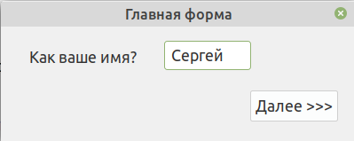
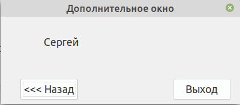
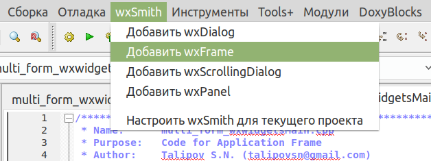
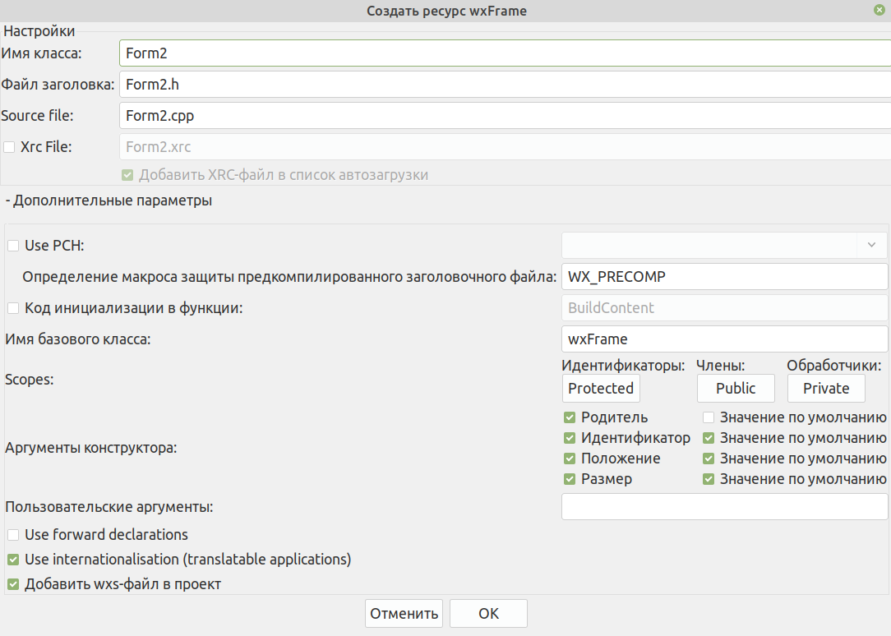
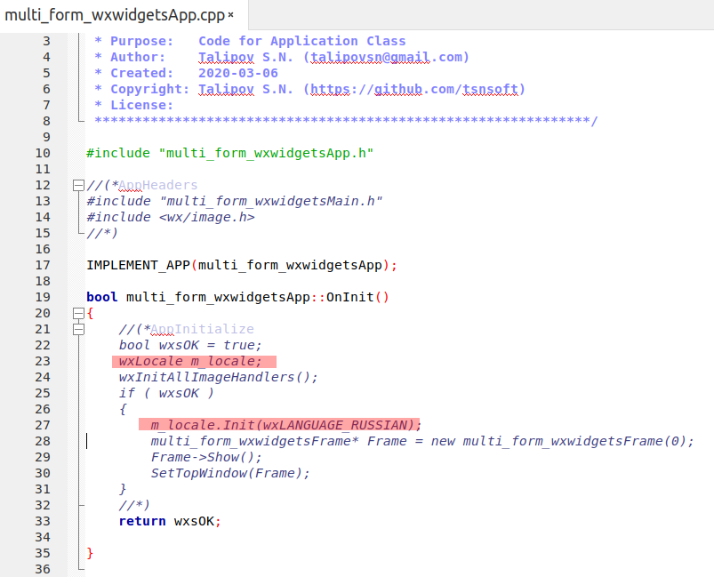

# multi_form_wxwidgets_linux
Пример многооконной программы на С++ в Code::Blocks (linux) с использованием wxFrame











*Строки поддержки русского языка в программе:*
```
wxLocale m_locale;
m_locale.Init(wxLANGUAGE_RUSSIAN);
```
